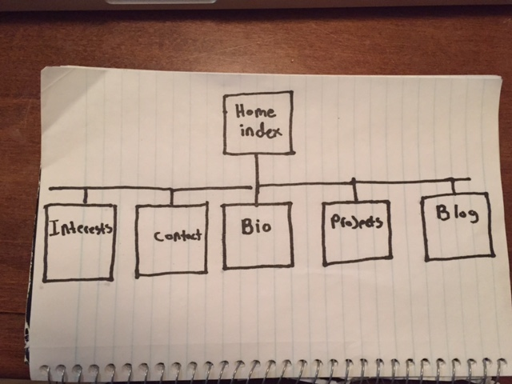

#Design Reflections

*What are the 6 Phases of Web Design?
  
  1.Information Gathering
  2.Planning
  3.Design
  4.Development
  5.Testing and Delivery
  6.Maintenance

*What is your site's primary goal or purpose? What kind of content will your site feature?

  My site's primary goal is to present who I am as a proffesional, my professional goals, and my portfolio to potential employers. My site will feature a bio, current and past projects, a link to my blog, my interests, and contact info/forms.

*What is your target audience's interests and how do you see your site addressing them?

  My target audience is potential web development employers and professional design teams. I would like for my website to address this audience in an engaging and inspirational manner. I would like the tone to be welcoming and not overly formal.

*What is the primary "action" the user should take when coming to your site? Do you want them to search for information, contact you, or see your portfolio? It's ok to have several actions at once, or different actions for different kinds of visitors.

  I would hope that the primary action of the user to be checking out the interesting things I am working on/creating or have created. Hopefully the user will feel compelled to check out more of the outlying content on my site after being engaged by the primary.

*What are the main things someone should know about design and user experience?

  Design should basically be about addressing the needs of the client/business, gearing toward a target audience, forming a layout for the content that makes sense and is user friendly, and delivering everything in a seamlessly integrated package. The design should also be formed around the user experience. How do you want the user to feel about and interact with the site. 

*What is user experience design and why is it valuable? 

 The user experience design is basically how a site or app makes a user feel and how they interact with it. UX is valuable because it determines how the system will address the users needs. 

*Which parts of the challenge did you find tedious?

  I found the UX article a bit long winded and redundant at times. Aside from that, nothing in this challenge was particularly  tedious.
