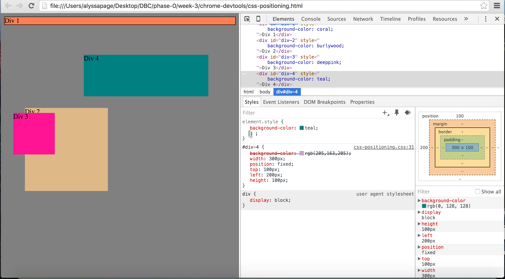
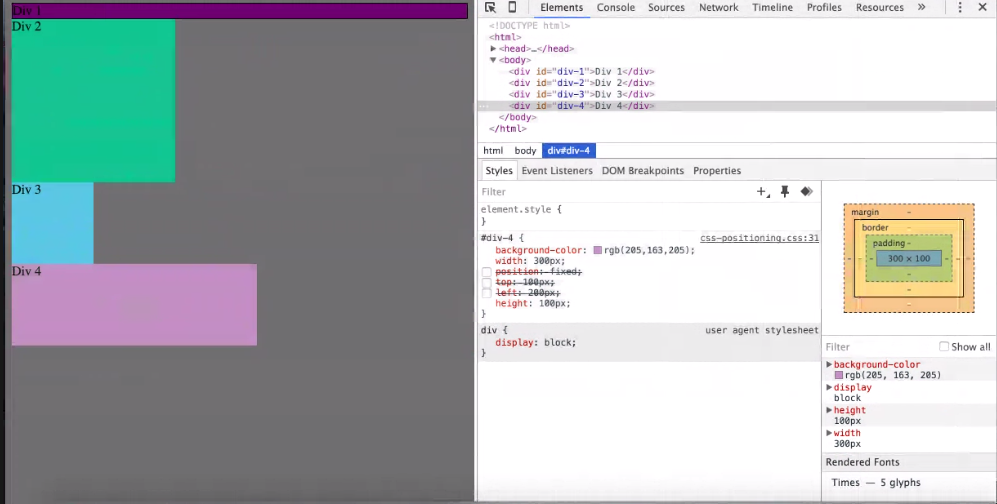
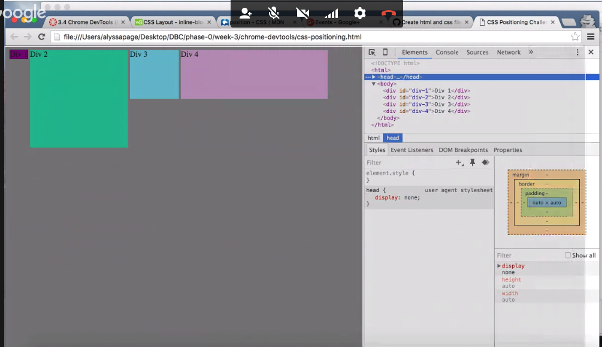
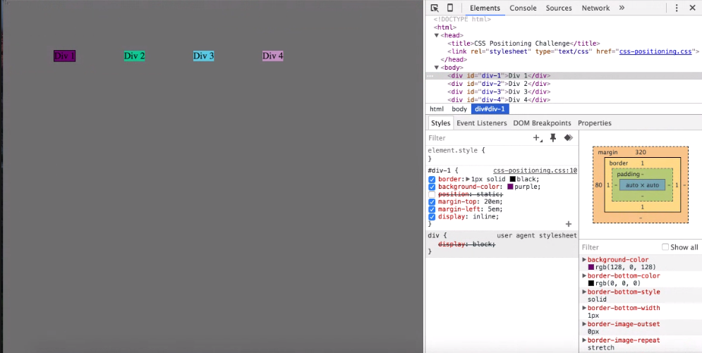
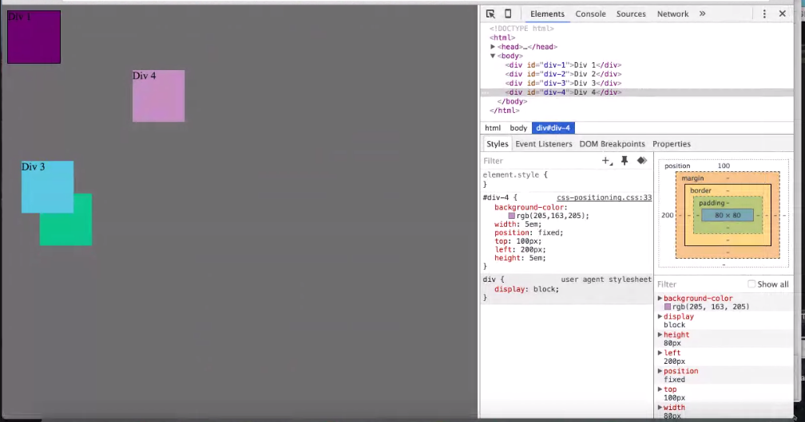
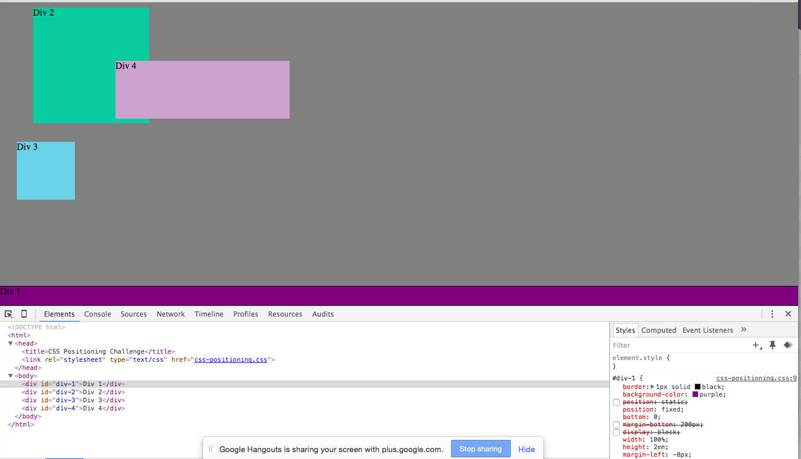
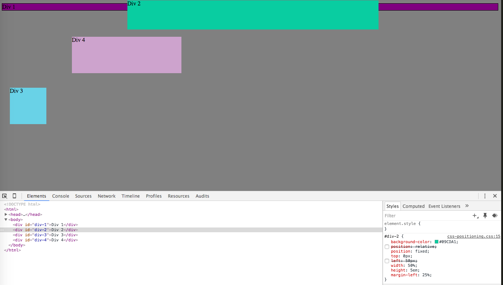
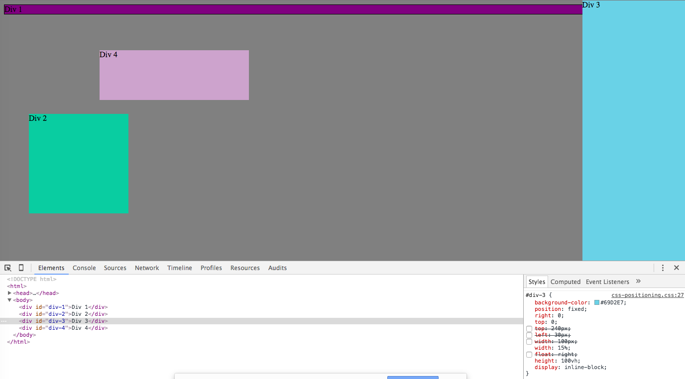
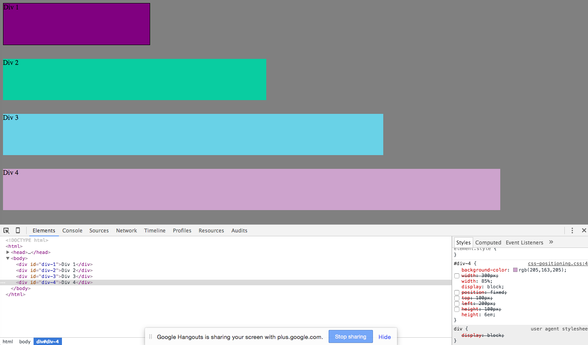

#Positioning Reflection

*How can you use Chrome's DevTools inspector to help you format or position elements?

	Coping and pasting HTML/CSS code you are working on into Chrome DevTools can help by allowing you to tinker with positioning of elements and see how they interact live in the browser.

*How can you resize elements on the DOM using CSS?

	You can resize by altering to CSS properties width and height of an element. the display property can also affect the size of certain elements.

*What are the differences between absolute, fixed, static, and relative positioning? Which did you find easiest to use? Which was most difficult?
	
	*absolute positioning places an element at a specifically defind spot in the browser regardless of it's parent element.
	*fixed positioning allows you ro place an element in a specific spot on the viewport. Scrolling will have no effect on where the element displays.
	*static positioning means that the element will display as normal or defined by the host browser.
	*relative positioning will posture an element a defined increment away from where that element would otherwise normally display.

	I foun using absolute positioning to be the most arduous and confusing. It seems slightly less predictable when interacting with other objects on the page because you are essentially removing the element from the relative flow of the rest of the objects on the page.

*What are the differences between margin, border, and padding?

	*The margin property sets a defined amount of space between the borders of an object and other elements on the page.
	*The border property sets the values of the outline of an objects. Whether or not they are visible, what color they are, how wide they are, etc.
	*The padding property sets how much space there will be between the borders of that object and the content inside.

*What was your impression of this challenge overall? (love, hate, and why?)

	I enjoyed this challenge. I love tinkering with CSS and immediately seeing how I can affect objects in a browser. It's kind of empowering.