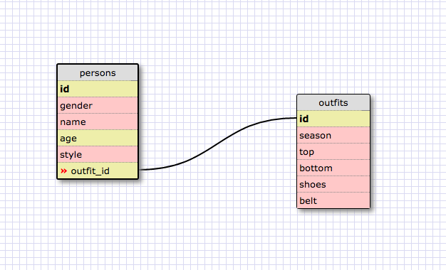

1
SELECT * FROM states;

2
 SELECT * FROM regions;

3
 SELECT state_name, population FROM states;

4
 SELECT state_name, population FROM states ORDER BY population DESC;

5
 SELECT state_name FROM states WHERE region_id = 7;

6
SELECT state_name, population_density FROM states WHERE population_density > 50 ORDER BY population_density ASC;

7
SELECT state_name FROM states WHERE population BETWEEN 1000000 and 1500000;

8
 SELECT state_name, region_id FROM states ORDER BY region_id ASC;

9
SELECT region_name FROM regions WHERE region_name LIKE '%Central%';

10
SELECT states.state_name, regions.region_name FROM states 
JOIN regions ON 
states.region_id = regions.id 
ORDER BY region_id ASC;

Reflections 

Q:What are databases for?
A:Databases are used for storing large portions of related data in a tble format

Q:What is a one-to-many relationship?
A:One-to-many relationships are relationships between a unique property and a set of many properties. Whe first-type unique property can have many of the second-type prperties. 

Q:What is a primary key? What is a foreign key? How can you determine which is which?
A:A primary key is the key for an entity instance. It must be unique. A foreign key is a key in one table that references a primary key in another table. The foreign key, by nature, will not necessarily be unique.

Q:How can you select information out of a SQL database? What are some general guidelines for that?
A:you can select info from an SQL database with the command: SELECT property_name FROM table_name; Make sure to end the command with a semicolon, also make sure that any SQL commands are in all cap.
