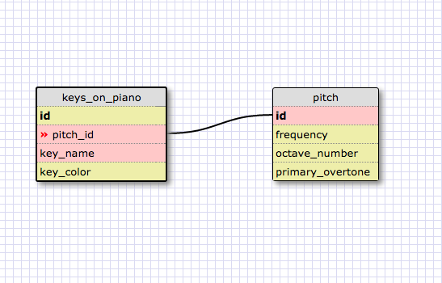
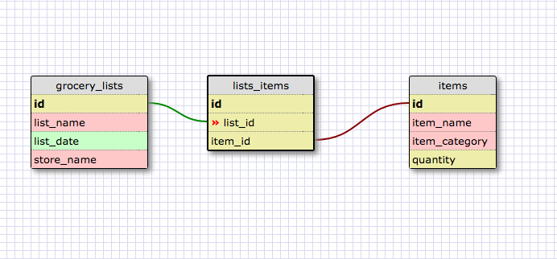

Reflections

Q:What is a one-to-one database?
A:A one-to-one database contains two entities that are related to eachother in such a way that each each can only have one of the other.

Q:When would you use a one-to-one database? (Think generally, not in terms of the example you created).
A:Generally you might have a one-to-one database where one entity contains the basic data that is most often queried while the other contains more specific related data. 

Q:What is a many-to-many database?
A:A many-to-many database contains two or more entities in which one entity could have many instances of the next entity and the next entity's instances could belong to many of the first entity's instances.

Q:When would you use a many-to-many database? (Think generally, not in terms of the example you created).
A:A many-to-many database would be used when one entity's instances could belong to multiple of anothers entity's instances and the other entity's instances could have many of the first entity's instances.

Q:What is confusing about database schemas? What makes sense?
A:Conceptually, database schemas make sense. I think I need some more real-world context for each of these different types before I really understand the practicality of when to use each.